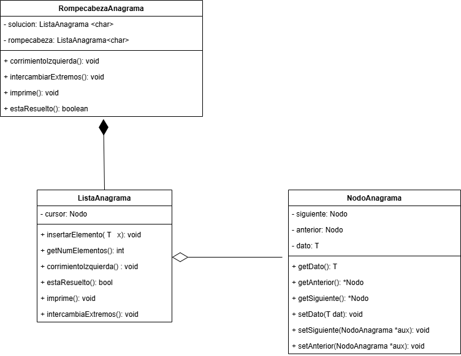

<h1> Practica 1</h1>

Objetivo: Emplear el concepto de lista circular doblemente ligada para resolver un juego de anagrama

<h3>Descripcion de la solución al problema del juego del anagrama</h3>

<h2>Uso de las siguientes clases</h2>

CLASE NODO

Dado que se esta trabajando con estructuras de datos, se implemento la clase Nodo el cual guardara la información de una letra de la palabra, asi como apuntadores al nodo anterior y al nodo siguiente con respecto al nodo con el que se esta trabajando en ese momento.

CLASE LISTA ANAGRAMA

Para hacer la simulación de las letras que forman la palabra se hizo uso de una lista circular doblemente ligada, donde cada nodo de la lista representa una letra de la palabra. El programa crea dos listas, la lista solución representa la palabra a la cual se quiere llegar, es decir el objetivo mientras que la palabra rompecabeza es la palabra a la cual se le busca una solución

CLASE ROMPECABEZA ANAGRAMA

Esta clase solo se encarga de crear las respectivas listas cuando se crean los objetos, es decir crea las listas desde el constructor, tiene métodos que se encargan de resolver el juego de anagrama, pero estos métodos solo se encargan de mandar a llamar las funciones de la clase listaAnagrama.h con el correspondiente paso de parametros que se necesitas

Para la solución del problema se hizo el diagrama de clases anterior, donde están presentes las clases anteriormente mencionadas, donde las relaciones son de la siguiente manera:
 
La relación entre la clase RompecabezaAnagrama y la clase ListaAnagrama es una relación de composición donde la clase RompecabezaAnagrama es la clase Todo y la clase ListaAnagrama es la clase parte, esto es porque objetos de la clase listaAnagrama no pueden existir sin que no haya un objeto de la clase RompecabezaAnagrama porque la lista se crea en el constructor de la clase RompecabezaAnagrama, es ahi donde se crean objeto de tipo ListaAnagrama.

La relación entre la clase NodoAnagrama y la clase ListaAnagrama es una relación de agregación ya que si bien una lista necesita de nodos para que tenga sentido que sea una lista, no es necesario que tenga nodos, es decir sería una lista de 0 elementos, no afecta en nada, no tendría las características de una lista pero no importaría, es por eso que la relación entre esas 2 clases es una relación de agregación

<h2>Explicación de los algoritmos para la solución del anagrama</h2>

void estaResuelto(ListaAnagrama listaAux)

Este método se encarga de recibir una lista, en este caso es la lista solución que es el caso a que se quiere llegar para llegar a la solución del ejercicio, primero se compara que el número de elementos sea igual, en caso contrario en automático no tiene solución, en caso de que ambas listas tengan el mismo numero de elementos, se procede a recorrer ambas listas a partir del nodo cursor, y se comparan ambos valores, en caso de que al momento de haber recorrido toda la lista todos los nodos son iguales se retorna el valor de true, que quiere decir que se ha podido resolver el anagrama, en caso contrario retornara false, que quiere decir que aun no se ha resulto el anagrama

void corrimientoIzquierda()

Para este método se necesita recorrer los valores que guardan los nodos una posición a la izquierda, para lo cual use el siguiente algorimo

corrimientoIzquierda()

{
   
    numNodos <- 1
    Nodo *actual <- cursor
    v1 <- actual.getDato()

    mientras numNodos <= numElementos:
        actual <- actual.getAnterior()
        v2 <- actual.getDato()
        actual.setDato(v1)
        v1 <- v2
        numNodos <- numNodos + 1
    fin del ciclo mientras 

}

Lo que este algoritmo hace es que va recorriendo los nodos que va visitando, cada vez que visita uno nuevo aumenta numNodos, esto hace mientras que no se hayan visitado todos los nodos de la lista, de lo contrario se recupera el valor guardado en el nodo actual y se guarda en v2, despues a este nodo se le pega el valor de v1, que es el nodo que estaba a la izquierda, esto para que se haga el corrimiento a la izquierda, el valor del nodo actual se copia en la variable v1, para que v2 pueda seguir recuperando los valores, es decir v1 se encarga de pegar los valores, y v2 se encarga de recuperarlos

void imprime()

Para solucionar este problema use el siguiente algoritmo:

imprime()

{
    Nodo *aux <- cursor
    nodosRecorridos <- 1

    mientras nodosRecorridos <= numElementos
        imprimir aux.getDato()
        aux <- aux.getSiguiente()
        nodosRecorridos <- nodosRecorridos + 1

}

Lo que este método hace es imprimir el valor de cada nodo desde el cursor mientras el número de nodosRecorridos sea menor o igual que el número de elementos de la lista, cada vez que imprime un valor de un nodo pasa al siguiente nodo de la lista e incrementa el valor de nodos que ya ha recorrido

void intercambiaExtremos()

Para este método use el siguiente algoritmo para su solución:

intercambiaExtremos()

{
    
    valor1 = cursor.getDato()
    valor2 = cursor.getAnterior().getDato()

    cursor.setDato(valor2)
    cursor.getAnterior().setDato(valor1)

}

Dado que una de las caracteristicas de las listas circulares doblemente ligadas es que el nodo anterior de la cabeza apunta al nodo ultimo de la lista y el ultimo nodo su apuntador de siguiente apunta al nodo cabeza, solo era obtener los valores de cada uno y establecerlos como correspondia

<h2>Funcionamiento del programa</h2>

Para probar el funcionamiento del programa recomendaría probarlo en el IDE codeblocks, se podría hacer en cualquier IDE pero hay que verificar que se tenga bien instalado y configurado el compilador del lenguaje C++, para esto hay que descargar los siguiente archivos del repositorio de github:

listaAnagrama.h

NodoAnagrama.h

RompecabezaAnagrama.h

pruebaAnagrama.cpp

Hacer la simulación del funcionamiento ejecutando el archivo pruebaPrograma.cpp, ahi aparecerá el menú del juego ya con palabras creadas para un objetivo y la palabra con la que se quiere llegar a ese objetivo, esto se define en la creación de un objeto RompecabezaAnagrama, donde la solución es "leo" y la palabra con la que se prente llegar a ese objetivo es con "loe", pruebe el algoritmo y diviertase jugando, en caso de querer ver rapidamente si el programa funciona o no, ingrese la opcion que corresponde a las siguiente acciones: 

corrimiento a la izquierda

intercambiar los extremos

¿esta resuelto?

Una vez que haya ingresado las opciones que corresponden las acciones anteriormente mencionadas podra ver que el rompecabezas se habra resuelto.

En caso de quiera probar con otras palabras lo que tendría que hacer es dirigirse al archivo pruebaPrograma.cpp, y en la línea 15 donde se crea el objeto de tipo RompecabezaAnagrama donde dice la palabra "leo", ingresar otra palabra, esta palabra que usted ingrese representaria la palabra destino es decir al objetivo que se planea llegar, y en donde dice "loe" debería de ingresar otra palabra que representara la palabra rompecabezas, es decir la palabra a la que se la aplicara las diversas operaciones de corrimiento, intercambio de extremos, etc para poder llegar a la palabra objetivo.

